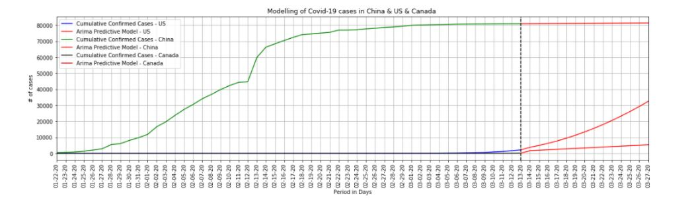

# ARIMA time series - COVID-19 US and Canada Case Prediction
<h3>Objective:</h3>
Using China's Covid-19 case trajectory as the training data predicting the cases for US and Canada using ARIMA model.

<h3>Data Source:</h3>
https://github.com/CSSEGISandData/COVID-19

<h3>Overview:</h3>
Using the cleaned dataset from January 22,2020 till March 13,2020, information was extracted for 9 different countries
namely China, Iran, Italy, South Korea, Japan , Singapore, US and Canada to carry out
further investigation and identifying patterns.

For each of these countries data was analysed in terms of the number of confirmed,
death and recovered cases using graphs, plotted using matplotlib library and also
compared all of these countries in terms of death percentage, recovered percentage ,
speed of infection and infection rate.

Furthermore, predicting the coronavirus cases for US and Canada using ARIMA time series modelling using China's data as training model. 

